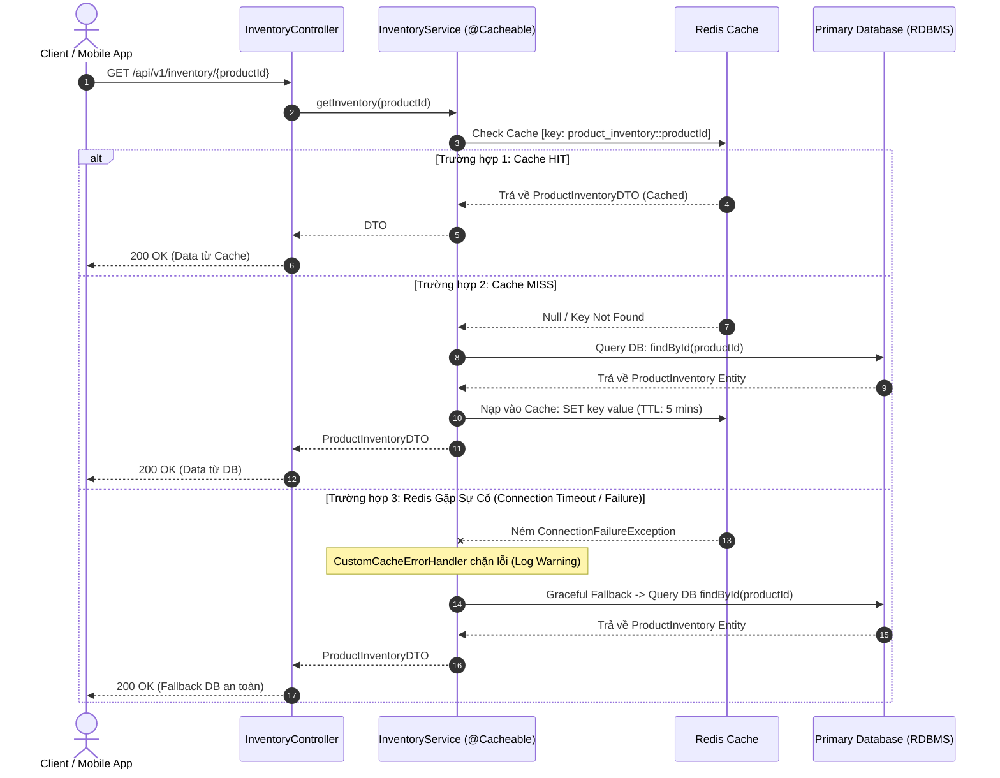
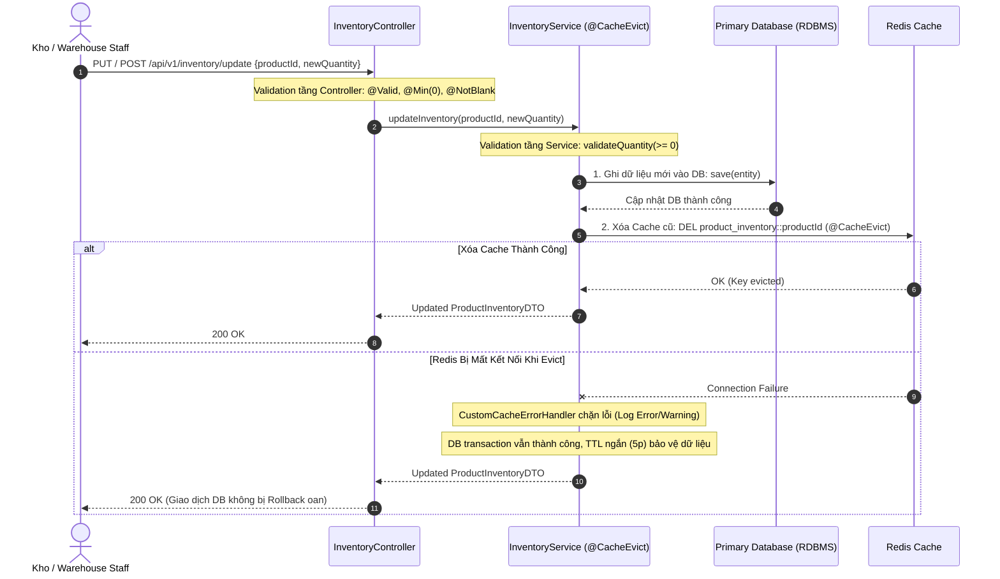

# BÁO CÁO PHÂN TÍCH & THIẾT KẾ: HỆ THỐNG QUẢN LÝ TỒN KHO CHÍNH XÁC (CACHE-ASIDE PATTERN)

**Dự án**: Hệ thống Quản lý Tồn kho (Inventory Management System - Tiki Case Study)  
**Mô hình kiến trúc**: Distributed Cache (Redis) + Primary RDBMS kết hợp Spring Boot & Spring Cache  
**Tác giả**: Kỹ sư Phần mềm Backend  
**Ngày thực hiện**: 23/09/2026  

---

## 1. TỔNG QUAN VÀ MỤC TIÊU HỆ THỐNG

Trong các sàn thương mại điện tử quy mô lớn như Tiki, hệ thống **Quản lý Tồn kho (Inventory Management)** là dịch vụ trọng yếu, đòi hỏi:
1. **Tốc độ phản hồi cực nhanh (Low Latency)**: Hàng triệu người dùng truy cập xem chi tiết sản phẩm và tồn kho cùng lúc.
2. **Tính nhất quán dữ liệu (Data Consistency)**: Tránh bán hàng vượt số lượng thực tế (*overselling*) hoặc hiển thị tồn kho sai lệch.
3. **Tính chịu lỗi cao (High Resilience & Fault Tolerance)**: Khi Redis cluster gặp sự cố ngắt kết nối hoặc timeout, luồng người dùng không bị sập (`500 Internal Server Error`), hệ thống phải tự động fallback về Database.

Để đáp ứng các yêu cầu trên, giải pháp chuẩn công nghiệp là áp dụng **Cache-Aside Pattern (Lazy Loading Pattern)** kết hợp với cơ chế **Custom Cache Error Handling** và **Input Validation đa tầng**.

---

## 2. PHÂN TÍCH THIẾT KẾ CACHE-ASIDE PATTERN

### 2.1. Bản chất của Cache-Aside Pattern
Trong mô hình Cache-Aside:
- **Ứng dụng trực tiếp điều phối** việc tương tác với cả Cache (Redis) và Database (RDBMS).
- **Thao tác đọc (Read)**: Ứng dụng tra cứu Cache trước. Nếu có dữ liệu (*Cache Hit*), trả về ngay lập tức. Nếu không có dữ liệu (*Cache Miss*), ứng dụng truy vấn từ Database, sau đó nạp dữ liệu vào Cache rồi trả về cho client.
- **Thao tác ghi (Write)**: Ứng dụng cập nhật dữ liệu vào Database trước (Source of Truth), sau đó tiến hành **xóa (Evict)** dữ liệu cũ trong Cache để buộc các lần đọc tiếp theo phải nạp dữ liệu mới nhất.

---

### 2.2. Sơ đồ Luồng Xử Lý (Sequence Diagrams)

#### A. Luồng Đọc Tồn Kho (Read Flow)



#### B. Luồng Cập Nhật Tồn Kho (Write Flow)



---

### 2.3. Đặc tả Input / Output của hai thao tác nghiệp vụ

| Thao tác | Input | Ràng buộc nghiệp vụ (Constraints) | Output Thành công | Output Thất bại |
| :--- | :--- | :--- | :--- | :--- |
| **Đọc tồn kho (Read)** | `productId` (String) | - Không được `null` hoặc rỗng (`@NotBlank`).<br>- Sản phẩm phải tồn tại trong hệ thống. | `ApiResponse<ProductInventoryDTO>`<br>- `productId`: "iphone-15"<br>- `productName`: "iPhone 15"<br>- `quantity`: 100<br>- `lastUpdated`: ISO-8601 | - `400 Bad Request`: `productId` không hợp lệ.<br>- `404 Not Found`: Không tìm thấy sản phẩm. |
| **Cập nhật tồn kho (Write)** | `productId` (String)<br>`newQuantity` (Integer) | - `productId`: Không rỗng.<br>- `newQuantity`: Không được `null` và **phải >= 0** (`@Min(0)`). | `ApiResponse<ProductInventoryDTO>`<br>- `productId`: "iphone-15"<br>- `quantity`: 95 (đã cập nhật) | - `400 Bad Request`: `newQuantity` âm (ví dụ: -10) hoặc thiếu trường.<br>- `404 Not Found`: Sản phẩm không tồn tại. |

---

## 3. GIẢI QUYẾT CÁC TÌNH HUỐNG BẪY DỮ LIỆU & SỰ CỐ KỸ THUẬT

### 3.1. Tình huống 1: Ngăn chặn số lượng tồn kho âm (`newQuantity < 0`)
* **Nguy cơ**: Nhân viên kho hoặc hệ thống tích hợp truyền nhầm số âm (ví dụ: `-10`), gây sai lệch logic tính toán đơn hàng, phát sinh đơn ảo.
* **Giải pháp đa tầng (Defense in Depth)**:
  1. **Tầng Controller (Bean Validation)**:
     ```java
     public class UpdateInventoryRequest {
         @NotBlank(message = "Product ID cannot be blank")
         private String productId;

         @NotNull(message = "Quantity cannot be null")
         @Min(value = 0, message = "Quantity must be greater than or equal to 0")
         private Integer newQuantity;
     }
     ```
  2. **Tầng Service (Business Rules Assertion)**:
     ```java
     private void validateQuantity(Integer quantity) {
         if (quantity == null) {
             throw new IllegalArgumentException("Quantity cannot be null.");
         }
         if (quantity < 0) {
             log.error("[VALIDATION ERROR] Attempted to update negative quantity: {}", quantity);
             throw new InvalidInventoryQuantityException(quantity);
         }
     }
     ```
  3. **Tầng Global Exception Handler**:
     Bắt `MethodArgumentNotValidException` và `InvalidInventoryQuantityException`, trả về mã lỗi HTTP `400 Bad Request` cùng thông điệp rõ ràng cho client.

---

### 3.2. Tình huống 2: Sự cố kết nối Redis (Connection Downtime / Timeout)

Mặc định trong Spring Cache, nếu Redis gặp sự cố mạng, các annotation `@Cacheable` và `@CacheEvict` sẽ ném ngoại lệ `RedisConnectionFailureException` làm sập toàn bộ request của người dùng (`500 Internal Server Error`).

Để giải quyết triệt để, hệ thống triển khai `CustomCacheErrorHandler` kế thừa từ `CacheErrorHandler` của Spring Cache:

```java
@Component
public class CustomCacheErrorHandler implements CacheErrorHandler {
    private static final Logger log = LoggerFactory.getLogger(CustomCacheErrorHandler.class);

    @Override
    public void handleCacheGetError(RuntimeException exception, Cache cache, Object key) {
        // Chặn ngoại lệ, ghi log cảnh báo -> Spring Cache xem như Cache MISS và tự động gọi DB
        log.warn(">>> [REDIS GET ERROR] Key '{}' trong cache '{}'. Fallback xuống Database. Lỗi: {}", 
                 key, cache.getName(), exception.getMessage());
    }

    @Override
    public void handleCachePutError(RuntimeException exception, Cache cache, Object key, Object value) {
        log.warn(">>> [REDIS PUT ERROR] Key '{}' cache '{}'. Lỗi: {}", key, cache.getName(), exception.getMessage());
    }

    @Override
    public void handleCacheEvictError(RuntimeException exception, Cache cache, Object key) {
        // Cho phép cập nhật DB thành công, không làm rollback transaction
        log.warn(">>> [REDIS EVICT ERROR] Không thể xóa key '{}' cache '{}'. Lỗi: {}", 
                 key, cache.getName(), exception.getMessage());
    }

    @Override
    public void handleCacheClearError(RuntimeException exception, Cache cache) {
        log.warn(">>> [REDIS CLEAR ERROR] Cache '{}'. Lỗi: {}", cache.getName(), exception.getMessage());
    }
}
```

---

## 4. ĐỀ XUẤT GIẢI PHÁP CHUYÊN SÂU KHI REDIS GẶP SỰ CỐ

### 4.1. Khi Redis bị lỗi khi đọc (GET)
* **Cơ chế Fallback**: `handleCacheGetError` nuốt ngoại lệ mạng, Spring Cache kích hoạt phương thức gốc `getInventory(productId)` truy vấn trực tiếp RDBMS.
* **Bảo vệ Database (Circuit Breaker & Rate Limiting)**:
  - Khi Redis chết hoàn toàn, hàng nghìn request đọc sẽ đổ dồn xuống DB (*Cache Stampede / Thundering Herd*).
  - Tích hợp thêm **Resilience4j Circuit Breaker** hoặc **RateLimiter** để giới hạn tải xuống Database, bảo vệ DB không bị sập theo.

### 4.2. Khi Redis bị lỗi khi xóa (EVICT) và giải pháp đảm bảo tính nhất quán (Eventual Consistency)
Nếu cập nhật DB thành công nhưng lệnh `EVICT` trên Redis bị thất bại do đứt kết nối mạng, Cache vẫn giữ số lượng cũ (`100` thay vì `95`), dẫn đến rủi ro hiển thị sai và overselling.

Các giải pháp đảm bảo tính nhất quán dữ liệu:

1. **Thiết lập TTL ngắn (Time-To-Live, ví dụ 3 - 5 phút)**:
   - Dù lệnh `evict` thất bại, sau thời gian TTL (ví dụ 5 phút), Redis tự động hủy key cũ, lần đọc kế tiếp sẽ nạp dữ liệu chuẩn từ DB. Đây là chốt chặn an toàn cơ bản nhất.
2. **Transactional Outbox Pattern kết hợp Message Queue (Kafka / RabbitMQ)**:
   - Trong cùng transaction cập nhật DB, ghi một bản tin sự kiện `InventoryUpdatedEvent` vào bảng `outbox_events`.
   - Một worker service đọc outbox và gửi event vào Kafka.
   - Cache Eviction Consumer sẽ lắng nghe event và thực hiện xóa cache với cơ chế **Retry & Exponential Backoff**, nếu Redis phục hồi sẽ xóa ngay.
3. **Change Data Capture (CDC) với Debezium**:
   - Debezium lắng nghe MySQL/PostgreSQL binlog và đẩy trực tiếp sự kiện thay đổi dữ liệu vào Kafka. Consumer chuyên biệt chịu trách nhiệm evict Redis Cache, loại bỏ hoàn toàn sự phụ thuộc giữa logic nghiệp vụ và hạ tầng Cache.

---

## 5. MÃ NGUỒN CỐT LÕI (CORE IMPLEMENTATION)

### 5.1. Cấu hình Redis Cache Manager (`RedisCacheConfig.java`)
```java
@Configuration
@EnableCaching
public class RedisCacheConfig implements CachingConfigurer {

    private final CustomCacheErrorHandler customCacheErrorHandler;

    public RedisCacheConfig(CustomCacheErrorHandler customCacheErrorHandler) {
        this.customCacheErrorHandler = customCacheErrorHandler;
    }

    @Bean
    public RedisCacheManager cacheManager(RedisConnectionFactory connectionFactory) {
        ObjectMapper objectMapper = new ObjectMapper();
        objectMapper.registerModule(new JavaTimeModule());
        objectMapper.activateDefaultTyping(
                objectMapper.getPolymorphicTypeValidator(),
                ObjectMapper.DefaultTyping.NON_FINAL,
                JsonTypeInfo.As.PROPERTY
        );

        GenericJackson2JsonRedisSerializer serializer = new GenericJackson2JsonRedisSerializer(objectMapper);

        RedisCacheConfiguration config = RedisCacheConfiguration.defaultCacheConfig()
                .entryTtl(Duration.ofMinutes(5)) // TTL 5 phút
                .disableCachingNullValues()
                .serializeKeysWith(RedisSerializationContext.SerializationPair.fromSerializer(new StringRedisSerializer()))
                .serializeValuesWith(RedisSerializationContext.SerializationPair.fromSerializer(serializer));

        return RedisCacheManager.builder(connectionFactory)
                .cacheDefaults(config)
                .build();
    }

    @Override
    public CacheErrorHandler errorHandler() {
        return customCacheErrorHandler;
    }
}
```

### 5.2. Nghiệp vụ Tồn kho chuẩn Cache-Aside (`InventoryServiceImpl.java`)
```java
@Service
@RequiredArgsConstructor
public class InventoryServiceImpl implements InventoryService {

    private final InventoryRepository inventoryRepository;
    public static final String CACHE_NAME = "product_inventory";

    @Override
    @Cacheable(value = CACHE_NAME, key = "#productId")
    public ProductInventoryDTO getInventory(String productId) {
        validateProductId(productId);
        // Chỉ chạy khi Cache Miss hoặc Redis Error Fallback
        ProductInventory item = inventoryRepository.findById(productId)
                .orElseThrow(() -> new ProductNotFoundException(productId));
        return toDTO(item);
    }

    @Override
    @CacheEvict(value = CACHE_NAME, key = "#productId")
    public ProductInventoryDTO updateInventory(String productId, Integer newQuantity) {
        validateProductId(productId);
        validateQuantity(newQuantity); // Chặn số lượng âm

        ProductInventory item = inventoryRepository.findById(productId)
                .orElseThrow(() -> new ProductNotFoundException(productId));

        item.setQuantity(newQuantity);
        item.setLastUpdated(LocalDateTime.now());
        ProductInventory saved = inventoryRepository.save(item); // 1. Ghi DB trước

        return toDTO(saved); // 2. Spring Cache tự động Evict sau khi method kết thúc
    }
}
```

---

## 6. KẾT QUẢ KIỂM THỬ (AUTOMATED TEST SUITE)

Bộ kiểm thử tự động gồm **18 test cases** đã vượt qua 100% (`BUILD SUCCESSFUL`):

| Nhóm Kiểm thử | File Test | Mục tiêu kiểm thử | Kết quả |
| :--- | :--- | :--- | :--- |
| **Service Unit Tests** | `InventoryServiceTest` | - Đọc tồn kho thành công (Cache Miss).<br>- Báo lỗi khi `productId` null/rỗng hoặc không tìm thấy.<br>- Cập nhật tồn kho thành công.<br>- **Chặn `newQuantity` âm (-10) và ném exception**.<br>- Cho phép cập nhật tồn kho về 0 (hết hàng). | **PASSED** (7/7) |
| **Resilience & Fallback** | `CacheErrorHandlerTest` | - Khi Redis GET lỗi: Suppress exception, cho phép fallback DB.<br>- Khi Redis PUT lỗi: Suppress exception, không làm chết request.<br>- Khi Redis EVICT lỗi: Ghi log warning, không rollback DB. | **PASSED** (4/4) |
| **REST Controller & Validation** | `InventoryControllerTest` | - GET `/api/v1/inventory/{id}` trả về 200 OK.<br>- GET sản phẩm không tồn tại trả về 404 Not Found.<br>- **POST với số lượng âm trả về 400 Bad Request**.<br>- POST với productId rỗng trả về 400 Bad Request.<br>- POST hợp lệ trả về 200 OK. | **PASSED** (5/5) |
| **Cache-Aside Lifecycle** | `CacheAsideSpringTest` | - Lần 1: Cache Miss -> gọi DB 1 lần.<br>- Lần 2: Cache Hit -> không gọi lại DB.<br>- Cập nhật: Update DB + Evict Cache.<br>- Lần 3: Cache Miss -> gọi DB để nạp tồn kho mới (95). | **PASSED** (1/1) |
| **Context Integration** | `Ss16B3ApplicationTests` | - Khởi tạo Spring Context an toàn. | **PASSED** (1/1) |

---

## 7. KẾT LUẬN

Hệ thống quản lý tồn kho đã được triển khai hoàn chỉnh theo đúng chuẩn **Cache-Aside Pattern**:
1. Đảm bảo hiệu năng cao với Redis Cache và tính nhất quán dữ liệu với Primary DB.
2. Ngăn chặn triệt để dữ liệu rác/số lượng âm bằng cơ chế kiểm tra đa tầng.
3. Cung cấp khả năng tự phục hồi và fallback trong suốt đối với người dùng cuối khi xảy ra sự cố Redis.
4. Đề xuất kiến trúc nhất quán dài hạn kết hợp TTL, Outbox Pattern và Message Queue cho môi trường sản xuất quy mô lớn.
